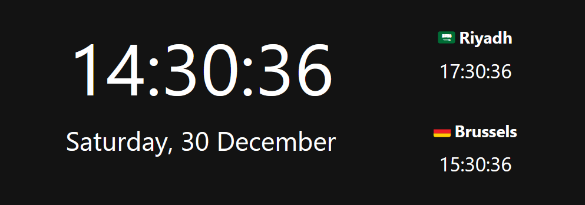
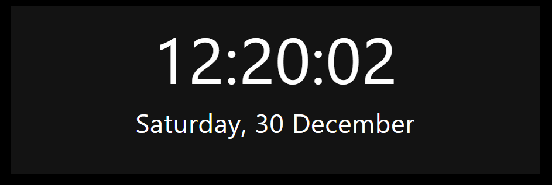

# Better Moment Card

[](https://github.com/custom-components/hacs)

**Current Version: 2024-03-30.1**
 
A lovelace card to show time & date exactly how you want e.g. HH:mm:ss DD/MM/YY. Inspired by Clockwork card. 

#### *Screenshot (Clockwork style):*


<div style="width: 60%; height: 50%">
  
  
  
</div>


## Install with HACS

To install via [HACS](https://hacs.xyz/) select the "Custom repositories" button add in the link in this format ***user* + *repository name***  (You can find this information at the top of the repository.  For category select  **Lovelace** then click "ADD".

After this navigate to "Frontend" click the plus symbol and enter "Better Moment Card" into the search bar. Then click on the first result.  and select "Install this repository in HACS" and you are done.

## Manual Installation

Download the release file then create a folder  "better-moment-card" in the www folder inside your Home Assistant install directory. Add the contents of the release zip so the files sits directly inside the folder you created i.e. better-moment-card/better-moment-card.js ... etc, then reference it accordingly inside Lovelace custom resources tab in the Dashboard.

```yaml
resource:
  - url: /local/better-moment-card/better-moment-card.js
    type: js
```

Refresh your browser and the plugin will load.

## Configuration

### Minimal required config: 
```Yaml
type: custom:better-moment-card
moment:
  - format: HH:mm:ss
```

The card has no default styling applied to it, you can use the parentStyle on either the root or individual moments, as explained below.

### All available options:

```Yaml
type: custom:better-moment-card
parentStyle: background-color:blue; # CSS applied to root card container - See DOM Tree
interval: 1000 # Milliseconds, how often DOM is written to (defaults to 1000 - every second)
moment:
  - format: YYYY # Date format (table below)
    timezone: Europe/Brussels # Uses IANA tz db format
    parentStyle: font-size:2em; text-align:center; # CSS for instance container - See DOM Tree
    template: | 
      It's <strong>{{ moment }}</strong> 
    # Output: It's *2024*
  
  - templateRaw: | # If specified, format: and timezone: are ignored and expected inside {{moment format=* timezone=*}} 
      It's currently <strong>{{ moment format=HH:mm }}</strong> 
      # Output: It's currently 09:40 (Uses local timezone)
      
      It's <strong>{{ moment format=HH:mm:ss timezone=Europe/Berlin }}in Berlin</strong> 
      # Overrides to Europe/Berlin timezone

      Berlin is offset <strong>{{ moment format=ZZ timezone=Europe/Berlin }} from UTC</strong> 
      # Ouput: Berlin is offset +0100 from UTC

```

## Example styles

#### Style 1

<div style="width: 60%; height: 50%">
  
  
  
</div>

```Yaml
type: custom:better-moment-card
parentStyle: line-height:4em;
moment:
  - format: HH:mm:ss
    parentStyle: font-size:4em; text-align:center; font-weight:400;
  - format: dddd, DD MMMM
    parentStyle: font-size:1.6em; text-align:center;
```

#### Style 2

<div style="width: 60%; height: 50%">
  
  
  
</div>

```Yaml
type: custom:better-moment-card
moment:
  - format: HH:mm:ss
    parentStyle: font-size:3em; text-align:center; padding:0 0 1em 0
  - format: dddd, DD MMMM YY
    parentStyle: font-size:2em; text-align:center;
```

#### Style 3

<div style="width: 60%; height: 50%">
  
  
  
</div>


```Yaml
type: custom:better-moment-card
parentStyle: |
  line-height:normal;
  padding-bottom:0em;
  display: grid; 
  grid-template-columns: 1fr 1fr 1fr; 
  grid-template-rows: 1fr 1fr; 
  gap: 0px; 
  grid-template-areas: 
    'time time riyadh'
    'date date brussells'; 
moment:
  - format: HH:mm:ss
    parentStyle: |
      font-size:4.4em; 
      text-align:center; 
      font-weight:400; 
      grid-area: time;
      font-weight:500
  - format: dddd, DD MMMM
    parentStyle: |
      font-size:1.6em;
      line-height:1em; text-align:center;
      padding-top:0.5em;
      grid-area: date; 
  - format: HH:mm:ss
    timezone: Asia/Riyadh
    parentStyle: |
      text-align:center; 
      line-height:2em; 
      padding-top:0.2em; 
      grid-area: riyadh;
    template: |
      <strong>🇸🇦 Riyadh</strong>
      <div style="font-size:1.2em;">{{moment}}</div>
  - format: HH:mm:ss
    timezone: Europe/Brussels
    parentStyle: |
      text-align:center; 
      line-height:2em; 
      grid-area: brussells;
    template: |
      <strong>🇩🇪 Brussels</strong>
      <div style="font-size:1.2em;">{{moment}}</div>
```

### DOM Tree

The `parentStyle` applies styling to the parent or instance div container. 

Each instance (moment) gets it's own ID too (moment-0, moment-1 etc), useful if you're also using card-mod (optional).

```
+-------------------------+
|    HA-card              |
|                         |
|  +----------------------+
|  | card-content         |
|  | (* parentStyle)      |
|  |  +-------------------+
|  |  | moment-0          |
|  |  | (** parentStyle)  |
|  |  +-------------------+
|  |  | moment-1          |
|  |  | (** parentStyle)  |
|  |  +-------------------+
|  +----------------------+
+-------------------------+
```

YAML Illustration (see asterix *)
```
type: custom:better-moment-card
parentStyle: |       *
  line-height:normal;
    'date date brussells'; 
moment:
  - format: HH:mm:ss
    parentStyle: |   **
      font-size:4.4em;
  - format: HH:mm:ss
    parentStyle: |   **
      font-size:4.4em;
```

### Timezones

By default, the plugin uses the browsers timezone. It does not use  Home Assistants time entity. A decision was made to not support this for several reasons i.e. performace issues, offline behavior and functionality issues.

When you specify a timezone, it needs to be in the IANA format in tz database, you can find them here: https://nodatime.org/TimeZones

i.e. `timezone: Europe/London` or `{{moment timezone=Europe/London}}`


### Date/Time Formats

These go inside ` - format: ` or `{{moment format=HH:mm}}`

| Format | Output           | Description                           |
| ------ | ---------------- | ------------------------------------- |
| `YY`   | 18               | Two-digit year                        |
| `YYYY` | 2018             | Four-digit year                       |
| `M`    | 1-12             | The month, beginning at 1             |
| `MM`   | 01-12            | The month, 2-digits                   |
| `MMM`  | Jan-Dec          | The abbreviated month name            |
| `MMMM` | January-December | The full month name                   |
| `D`    | 1-31             | The day of the month                  |
| `DD`   | 01-31            | The day of the month, 2-digits        |
| `d`    | 0-6              | The day of the week, with Sunday as 0 |
| `dd`   | Su-Sa            | The min name of the day of the week   |
| `ddd`  | Sun-Sat          | The short name of the day of the week |
| `dddd` | Sunday-Saturday  | The name of the day of the week       |
| `H`    | 0-23             | The hour                              |
| `HH`   | 00-23            | The hour, 2-digits                    |
| `h`    | 1-12             | The hour, 12-hour clock               |
| `hh`   | 01-12            | The hour, 12-hour clock, 2-digits     |
| `m`    | 0-59             | The minute                            |
| `mm`   | 00-59            | The minute, 2-digits                  |
| `s`    | 0-59             | The second                            |
| `ss`   | 00-59            | The second, 2-digits                  |
| `SSS`  | 000-999          | The millisecond, 3-digits             |
| `Z`    | +05:00           | The offset from UTC, ±HH:mm           |
| `ZZ`   | +0500            | The offset from UTC, ±HHmm            |
| `A`    | AM PM            |                                       |
| `a`    | am pm            |                                       |

## Todo 
    [ ] Add locales / internationalization (if demand requires)
    

## Feature requests

Requests for features can be submitted through an issue however would prefer you submit your own PR which I'll approve.


## DISCLAIMER

Wrote this for personal use but decided to release it, no warranty.
