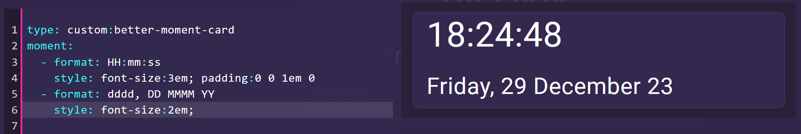

# Better Momenet Card

[](https://github.com/custom-components/hacs)

**Current Version:** 0.0.2

A custom lovelace card that's highly customizable to show custom date and time, digital clocks using any datetime combination of your choosing i.e. DD/MM/YY HH:mm. Uses the day.js library. 

Inspired by the Clockwork and Simple clock cards. Here's an example - :


Config example: 



## INSTALL WITH HACS

To install via [HACS](https://hacs.xyz/) select the "Custom repositories" button add in the link in this format ***user* + *repository name***  (You can find this information at the top of the repository.  For category select  **Lovelace** then click "ADD".

After this navigate to "Frontend" click the plus symbol and enter "Better Moment Card" into the search bar. Then click on the first result.  and select "Install this repository in HACS" and you are done!

## MANUAL INSTALLATION

To install add it to your custom lovelace folder and then reference it accordingly

```yaml
resource:
  - url: /local/better-moment-card/better-moment-card.js
    type: js
```

## CONFIGURATION

This will use your clients timezone. It does not use a Home Assistant time entity.

Minimum config required: 
```Yaml
type: custom:better-moment-card
moment:
  - format: HH:mm:ss
```

All options

```Yaml
type: custom:better-moment-card
parentStyle: background-color:blue;
moment:
  - format: YYYY
    style: font-size:2em; text-align:center; 
    template: |
      Oh hi <strong>{{moment}}</strong> 
```

Some ideas to get you started 

```Yaml
type: custom:better-moment-card
moment:
  - format: HH:mm:ss
    style: font-size:3em; text-align:center; padding:0 0 1em 0
  - format: dddd, DD MMMM YY
    style: font-size:2em; text-align:center;
```

#### All available date formats

These go inside `  - format: `

| Format | Output           | Description                           |
| ------ | ---------------- | ------------------------------------- |
| `YY`   | 18               | Two-digit year                        |
| `YYYY` | 2018             | Four-digit year                       |
| `M`    | 1-12             | The month, beginning at 1             |
| `MM`   | 01-12            | The month, 2-digits                   |
| `MMM`  | Jan-Dec          | The abbreviated month name            |
| `MMMM` | January-December | The full month name                   |
| `D`    | 1-31             | The day of the month                  |
| `DD`   | 01-31            | The day of the month, 2-digits        |
| `d`    | 0-6              | The day of the week, with Sunday as 0 |
| `dd`   | Su-Sa            | The min name of the day of the week   |
| `ddd`  | Sun-Sat          | The short name of the day of the week |
| `dddd` | Sunday-Saturday  | The name of the day of the week       |
| `H`    | 0-23             | The hour                              |
| `HH`   | 00-23            | The hour, 2-digits                    |
| `h`    | 1-12             | The hour, 12-hour clock               |
| `hh`   | 01-12            | The hour, 12-hour clock, 2-digits     |
| `m`    | 0-59             | The minute                            |
| `mm`   | 00-59            | The minute, 2-digits                  |
| `s`    | 0-59             | The second                            |
| `ss`   | 00-59            | The second, 2-digits                  |
| `SSS`  | 000-999          | The millisecond, 3-digits             |
| `Z`    | +05:00           | The offset from UTC, ±HH:mm           |
| `ZZ`   | +0500            | The offset from UTC, ±HHmm            |
| `A`    | AM PM            |                                       |
| `a`    | am pm            |                                       |

## Todo 
    [ ] Add locales (if there's demand)
    
## DISCLAIMER

Wrote this for personal use but decided to release it, no warranty.
