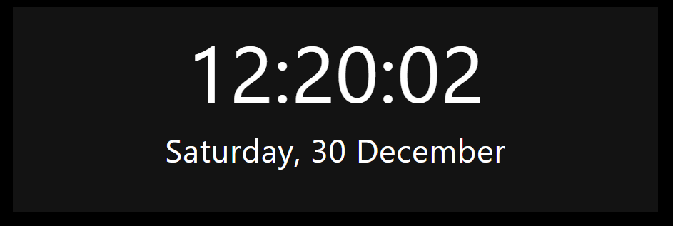

# Better Moment Card

A lovelace card to show time/dates exactly how you want on your dashboard.

<p align="center" style="width: 60%; height: 50%">

[](https://raw.githubusercontent.com/ibz0q/better-moment-card/main/docs/live-preview.gif)
</p>

## Features:
- Infinitely customizable
- Custom fonts
- HTML/CSS Templating (Multiple Time + Sensors support)
- Timezone and Locale support
- Sample styles provided


#### Table of Contents
  - [Examples](#example-styles)
  - [HACS installation](#hacs-installation)
  - [Manual installation](#manual-installation)
  - [All available options](#all-available-options)
  - [Timezones](#timezones)
  - [Internationalization / Locales](#internationalization--locales)
  - [Helper functions](#helper-functions)
  - [Layouts (Sections)](#layouts-sections)
  - [Date/Time Formats](#datetime-formats)
  - [DOM Structure](#dom-structure)

### Example styles

#### Style 1

<div style="width: 60%; height: 50%">
  
  
  
</div>

```Yaml
type: custom:better-moment-card
moment:
  - format: HH:mm:ss
    parentStyle: font-size:3em; text-align:center; padding:0 0 1em 0
  - format: cccc, dd MMMM yy
    parentStyle: font-size:2em; text-align:center;
```

#### Style 2

<div style="width: 60%; height: 50%">
  
  
  
</div>

```Yaml
type: custom:better-moment-card
parentStyle: line-height:4em;
moment:
  - format: HH:mm:ss
    parentStyle: font-size:4em; text-align:center; font-weight:400;
  - format: cccc, dd MMMM
    parentStyle: font-size:1.6em; text-align:center;
```

#### Style 3

<p align="center" style="width: 60%; height: 50%">

[](https://raw.githubusercontent.com/ibz0q/better-moment-card/main/docs/live-preview.gif)
</p>

The background animations in this preview use "lovelace-bg-animation" https://github.com/ibz0q/lovelace-bg-animation

```Yaml
type: custom:better-moment-card
parentStyle: |
  line-height:normal;
  padding-bottom:0em;
  display: grid; 
  grid-template-columns: 1fr 1fr 1fr; 
  grid-template-rows: 1fr 1fr; 
  gap: 0px; 
  grid-template-areas: 
    'time time riyadh'
    'date date brussells'; 
moment:
  - format: HH:mm:ss
    parentStyle: |
      font-size:4.4em; 
      text-align:center; 
      font-weight:400; 
      grid-area: time;
      font-weight:500
  - format: cccc, dd MMMM
    parentStyle: |
      font-size:1.6em;
      line-height:1em; text-align:center;
      padding-top:0.5em;
      grid-area: date; 
  - format: HH:mm:ss
    timezone: Asia/Riyadh
    parentStyle: |
      text-align:center; 
      line-height:2em; 
      padding-top:0.2em; 
      grid-area: riyadh;
    template: |
      <strong>🇸🇦 Riyadh</strong>
      <div style="font-size:1.2em;">{{moment}}</div>
  - format: HH:mm:ss
    timezone: Europe/Brussels
    parentStyle: |
      text-align:center; 
      line-height:2em; 
      grid-area: brussells;
    template: |
      <strong>🇧🇪 Brussels</strong>
      <div style="font-size:1.2em;">{{moment}}</div>
```

## HACS installation

Search "Better Moment Card" in HACs and Download.

## Manual installation

Download the release file then create a folder "better-moment-card" in the www folder inside your Home Assistant install directory. Add the contents of the release zip so the files sits directly inside the folder you created i.e. better-moment-card/better-moment-card.js ... etc, reference it accordingly inside Lovelace custom resources tab in the Dashboard.

```Yaml
resource:
  - url: /local/better-moment-card/better-moment-card.js
    type: js
```

Refresh your browser.

## All available options 

```Yaml
type: custom:better-moment-card
parentStyle: > # CSS applied to root card container (See DOM Tree) 
  font-family: Avant Garde,Avantgarde,Century
  Gothic,CenturyGothic,AppleGothic,sans-serif; 
interval: 1000 # In milliseconds: how often DOM is written to (defaults to 1000 - every second)
helper: 
  exampleHelper: |
    return 1+1; # 2
moment:
  - format: yyyy # Date format (table below)
    timezone: Europe/Brussels # Uses IANA format | "useHass" # Use Home Assistant Global TZ | "useEntity[input_select.timezone.state] # Use an entity.
    locale: ar # See Luxon.js API docs for all languages
    localeSetting: # See Luxon.js API docs
        year: "numeric"
        month: "long"
        day: "numeric"
        hour: "numeric"
        minute: "2-digit"
        timeZoneName: "short"
    parentStyle: font-size:2em; text-align:center; # CSS for indivdual instance - See DOM Tree
    template: | 
      It's <strong> {{moment}} </strong> # It's *2024*
  
  - templateRaw: | # If specified, format, timezone, locale, localeSettings are ignored and can be passed inside {{moment format=* timezone=*}}
      It's currently <strong> {{moment format=HH:mm}} </strong> # It's currently 09:40 (Uses local timezone)
      
      It's <strong> {{moment format=HH:mm:ss timezone=Europe/Berlin}} in Berlin</strong> 
      # Sets timezone to Europe/Berlin

      This is what the time looks like in <strong> {{moment format=HH:mm:ss locale=ar}} in Arabic</strong> 

      Berlin is offset <strong> {{moment format=ZZ timezone=Europe/Berlin}} from UTC</strong> # Berlin is offset +0100 from UTC
      
      Output from my helper is [[exampleHelper]] # 3
      
    helper: 
      exampleHelper: |
        return 1+2; # 3
```

## Timezones

The plugin uses the timezone on the device viewed on. It does not use  Home Assistants time entity (for performace reasons, offline behaviour). Specify a timezone in the IANA format, you can find them here: https://nodatime.org/TimeZones

i.e. `timezone: Europe/London` or `{{moment timezone=Europe/London}}`

Use Home Assistants timezone:

i.e. `timezone: useHass` or `{{moment timezone=useHass}}`

You can also use a sensors value as a Timezone. 

All examples:

```YAML
type: custom:better-moment-card
moment:
  - format: tttt
    timezone:  useEntity[input_select.timezone.attribute.someattr] # Uses a TZ from a sensor (Value must be a valid IANA TZ)
  - format: tttt
    timezone: useHass # Uses Home Assistants TZ
  - templateRaw: |
      {{moment timezone=useEntity[input_select.attribute.someattr]}}
```

## Internationalization / Locales

To use a specific locale defined it like so:

i.e. `locale: ar` or `{{moment locale=ar}}`

Example:

```YAML
type: custom:better-moment-card
moment:
  - format: tttt
    locale: fr
  - format: tttt
    locale: ar
  - format: tttt
    locale: ca
  - templateRaw: |
      {{moment format=tttt locale=chi}}
```
Result:


#### Granualar control

You can use localeSetting to pass in "toLocaleString", refer to [Luxon.js toLocaleString](https://moment.github.io/luxon/api-docs/index.html#datetimetolocalestring)

Example:

```YAML
type: custom:better-moment-card
moment:
  - format: tttt
    locale: ar
    localeSetting: 
      year: numeric
      month: long
      day: numeric 
      hour: numeric 
      minute: 2-digit
      timeZoneName: short
  - templateRaw: |
      {{moment locale=ar localeSetting={"year": "numeric","month": "long","day": "numeric","hour":"numeric","minute": "2-digit","timeZoneName": "short"} }}
```

When using `localeSetting` inside a `template` or `templateRaw`, it expects a properly formatted JSON string, if you face issues please check using an online linter and ensure you are passing in a valid JSON string.

## Helper functions

You can execute full JS using helper functions, the intended function is to give you access to Home Assistant states allowing powerful customization.

```YAML
type: custom:better-moment-card
moment:
   - helper: 
      someTempSensor: |
          var somestring = "Temp is";
          console.log(param;
          return somestring + hass.states["binary_sensor.door_sensor_contact"].attribute.temprature

     templateRaw: |
        {{moment format=HH:mm }}
        Data from my temp sensor: [[someTempSensor(hi)]]
```

APIs available: 

| Name     | Object                   |
|----------|--------------------------|
| DateTime | Luxon.js instance        |
| hass     | Home Assistant JS Object |
| config   | Full Moment Config Object            |
| param    | Parameter passed through via helperName(thisparam) i.e.  thisparam                      |
|          |                          |

## Layouts (Sections)

The Sections layout assumes cards are a fixed height but your layout may change the assumption and you may wish to override this.

If you are facing issues with Sections or layout in general, try using layout_options or grid_options to adjust to your desired card size.

```YAML
type: custom:better-moment-card
layout_options:
  grid_rows: 3
  grid_max_rows: 3
  grid_min_rows: 3
grid_options:
  columns: full
  rows: 3
moment:
  - format: HH:mm:ss
```

AFAIK there is no dynamic option available to me as a dev so this may be required in certain circumstances.

## Date/Time Formats

These go inside ` - format: ` or `{{moment format=HH:mm}}`


| Standalone token | Format token | Description                                                    | Example                                                       |
| ---------------- | ------------ | -------------------------------------------------------------- | ------------------------------------------------------------- |
| S                |              | millisecond, no padding                                        | `54`                                                          |
| SSS              |              | millisecond, padded to 3                                       | `054`                                                         |
| u                |              | fractional seconds, functionally identical to SSS              | `054`                                                         |
| uu               |              | fractional seconds, between 0 and 99, padded to 2              | `05`                                                          |
| uuu              |              | fractional seconds, between 0 and 9                            | `0`                                                           |
| s                |              | second, no padding                                             | `4`                                                           |
| ss               |              | second, padded to 2 padding                                    | `04`                                                          |
| m                |              | minute, no padding                                             | `7`                                                           |
| mm               |              | minute, padded to 2                                            | `07`                                                          |
| h                |              | hour in 12-hour time, no padding                               | `1`                                                           |
| hh               |              | hour in 12-hour time, padded to 2                              | `01`                                                          |
| H                |              | hour in 24-hour time, no padding                               | `9`                                                           |
| HH               |              | hour in 24-hour time, padded to 2                              | `13`                                                          |
| Z                |              | narrow offset                                                  | `+5`                                                          |
| ZZ               |              | short offset                                                   | `+05:00`                                                      |
| ZZZ              |              | techie offset                                                  | `+0500`                                                       |
| ZZZZ             |              | abbreviated named offset                                       | `EST`                                                         |
| ZZZZZ            |              | unabbreviated named offset                                     | `Eastern Standard Time`                                       |
| z                |              | IANA zone                                                      | `America/New_York`                                            |
| a                |              | meridiem                                                       | `AM`                                                          |
| d                |              | day of the month, no padding                                   | `6`                                                           |
| dd               |              | day of the month, padded to 2                                  | `06`                                                          |
| c                | E            | day of the week, as number from 1-7 (Monday is 1, Sunday is 7) | `3`                                                           |
| ccc              | EEE          | day of the week, as an abbreviate localized string             | `Wed`                                                         |
| cccc             | EEEE         | day of the week, as an unabbreviated localized string          | `Wednesday`                                                   |
| ccccc            | EEEEE        | day of the week, as a single localized letter                  | `W`                                                           |
| L                | M            | month as an unpadded number                                    | `8`                                                           |
| LL               | MM           | month as a padded number                                       | `08`                                                          |
| LLL              | MMM          | month as an abbreviated localized string                       | `Aug`                                                         |
| LLLL             | MMMM         | month as an unabbreviated localized string                     | `August`                                                      |
| LLLLL            | MMMMM        | month as a single localized letter                             | `A`                                                           |
| y                |              | year, unpadded                                                 | `2014`                                                        |
| yy               |              | two-digit year                                                 | `14`                                                          |
| yyyy             |              | four- to six- digit year, pads to 4                            | `2014`                                                        |
| G                |              | abbreviated localized era                                      | `AD`                                                          |
| GG               |              | unabbreviated localized era                                    | `Anno Domini`                                                 |
| GGGGG            |              | one-letter localized era                                       | `A`                                                           |
| kk               |              | ISO week year, unpadded                                        | `14`                                                          |
| kkkk             |              | ISO week year, padded to 4                                     | `2014`                                                        |
| W                |              | ISO week number, unpadded                                      | `32`                                                          |
| WW               |              | ISO week number, padded to 2                                   | `32`                                                          |
| ii               |              | Local week year, unpadded                                      | `14`                                                          |
| iiii             |              | Local week year, padded to 4                                   | `2014`                                                        |
| n                |              | Local week number, unpadded                                    | `32`                                                          |
| nn               |              | Local week number, padded to 2                                 | `32`                                                          |
| o                |              | ordinal (day of year), unpadded                                | `218`                                                         |
| ooo              |              | ordinal (day of year), padded to 3                             | `218`                                                         |
| q                |              | quarter, no padding                                            | `3`                                                           |
| qq               |              | quarter, padded to 2                                           | `03`                                                          |
| D                |              | localized numeric date                                         | `9/4/2017`                                                    |
| DD               |              | localized date with abbreviated month                          | `Aug 6, 2014`                                                 |
| DDD              |              | localized date with full month                                 | `August 6, 2014`                                              |
| DDDD             |              | localized date with full month and weekday                     | `Wednesday, August 6, 2014`                                   |
| t                |              | localized time                                                 | `9:07 AM`                                                     |
| tt               |              | localized time with seconds                                    | `1:07:04 PM`                                                  |
| ttt              |              | localized time with seconds and abbreviated offset             | `1:07:04 PM EDT`                                              |
| tttt             |              | localized time with seconds and full offset                    | `1:07:04 PM Eastern Daylight Time`                            |
| T                |              | localized 24-hour time                                         | `13:07`                                                       |
| TT               |              | localized 24-hour time with seconds                            | `13:07:04`                                                    |
| TTT              |              | localized 24-hour time with seconds and abbreviated offset     | `13:07:04 EDT`                                                |
| TTTT             |              | localized 24-hour time with seconds and full offset            | `13:07:04 Eastern Daylight Time`                              |
| f                |              | short localized date and time                                  | `8/6/2014, 1:07 PM`                                           |
| ff               |              | less short localized date and time                             | `Aug 6, 2014, 1:07 PM`                                        |
| fff              |              | verbose localized date and time                                | `August 6, 2014, 1:07 PM EDT`                                 |
| ffff             |              | extra verbose localized date and time                          | `Wednesday, August 6, 2014, 1:07 PM Eastern Daylight Time`    |
| F                |              | short localized date and time with seconds                     | `8/6/2014, 1:07:04 PM`                                        |
| FF               |              | less short localized date and time with seconds                | `Aug 6, 2014, 1:07:04 PM`                                     |
| FFF              |              | verbose localized date and time with seconds                   | `August 6, 2014, 1:07:04 PM EDT`                              |
| FFFF             |              | extra verbose localized date and time with seconds             | `Wednesday, August 6, 2014, 1:07:04 PM Eastern Daylight Time` |
| X                |              | unix timestamp in seconds                                      | `1407287224`                                                  |
| x                |              | unix timestamp in milliseconds                                 | `1407287224054`                                               |


## DOM structure

The `parentStyle` applies styling to the parent or instance div container. 

Each instance (moment) gets it's own ID too (moment-0, moment-1 etc), useful if you're also using card-mod (optional).

```
+-------------------------+
|    HA-card              |
|                         |
|  +----------------------+
|  | card-content         |
|  | (parentStyle *)      |
|  |  +-------------------+
|  |  | moment-0          |
|  |  | (parentStyle **)  |
|  |  +-------------------+
|  |  | moment-1          |
|  |  | (parentStyle **)  |
|  |  +-------------------+
|  +----------------------+
+-------------------------+
```

YAML Illustration (see asterix *)

```YAML
type: custom:better-moment-card
parentStyle: |       *
  line-height:normal;
    'date date brussells'; 
moment:
  - format: HH:mm:ss
    parentStyle: |   **
      font-size:4.4em;
  - format: HH:mm:ss
    parentStyle: |   **
      font-size:4.4em;
```

## Feature requests

Requests for features can be submitted through an issue.

## Disclaimer

Wrote this for personal use but decided to release it, no warranty.
